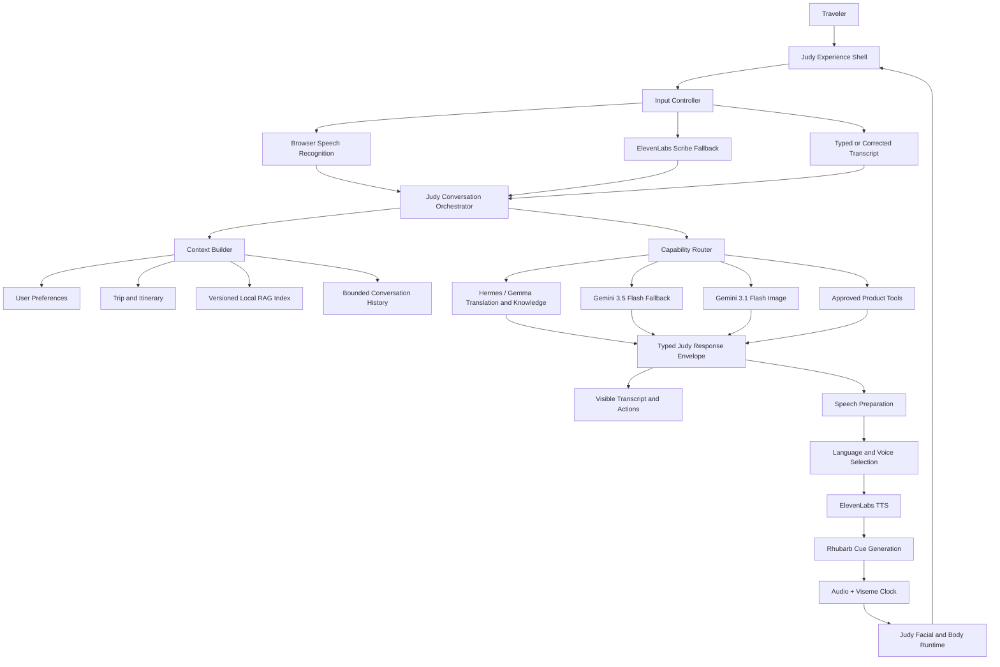

# Judy Pierre Avatar, Intelligence, and Experience Architecture Plan

**Status:** implementation plan based on the repository at `main` commit `49f7abe` plus the uncommitted work present on 2026-07-22
**Product decision:** Judy Pierre is the primary interface and intelligence hub. Trip tools support the conversation; they do not compete with it.
**Plan format:** phased by dependency and risk, with no timeline.

## 1. Executive decision

Keep `public/models/judyface.glb` as Judy's active bundled avatar. It is the only inspected asset that satisfies the current speech-animation contract. Do not activate any of the recently supplied Tripo meshes until they are facially rigged and pass the same automated validator.

The target experience is an avatar-first travel concierge:

- Judy remains visible, camera-facing, and responsive through the normal interaction flow.
- A single compact toolbar controls listening, typing, stopping, translation, and tool drawers.
- Transcript, itinerary, memories, alerts, and settings open as mutually exclusive drawers around Judy rather than as overlapping floating panels.
- One server-side conversation orchestrator assembles user/trip/RAG context, routes work to Gemma/Hermes or Gemini, executes approved tools, and returns a typed response envelope for text, voice, citations, and UI actions.
- Voice audio remains synchronized with the facial rig through ElevenLabs and Rhubarb, with browser speech and approximate mouth motion as fallbacks.

## 2. Current-state audit

### 2.1 Repository and verification state

- Branch: `main`.
- Current HEAD: `49f7abe` (`feat: overhaul avatar UI, add full-screen mode, and setup affiliates page`).
- The worktree already contained uncommitted edits before this review. They must be reviewed and preserved; this plan does not authorize discarding them.
- Lint currently exits successfully with warnings.
- The full test suite began at **324 passing / 5 failing**. Restoring the canonical facial avatar removed the avatar failure; **four Dashboard tests remain failing** because the recent immersive rewrite removed or relocated UI behavior without updating its contract.
- The four remaining failures cover navigation/affiliate access, the focused-home widget contract, the no-trip empty state, and weather-error visibility.
- A production build still needs to be rerun after the dirty worktree is reconciled and the intended Dashboard behavior is decided.

### 2.2 Avatar asset decision

| Asset | Skin/joints | Facial control | Clips | Decision |
|---|---:|---|---:|---|
| `public/models/judyface.glb` | 1 skin / 22 joints | `jaw` plus `viseme_A` through `viseme_X` | 0 | **Keep and use** |
| `public/models/judyrig.glb` | 1 skin / 22 joints | jaw bone only; no morph targets | 0 | Legacy fallback only |
| `public/models/JobuJudy.glb` | 1 skin / 22 joints | jaw bone only; no morph targets | 6 body clips | Dormant legacy asset |
| `public/judysync.glb` | none | none | 0 | Never use as the speaking avatar |
| `judy-v.glb` and inspected timestamp-named Tripo candidates in Downloads | none | none | 0 | Reject for avatar activation |
| previously supplied `judy_four.glb` | earlier inspection found a skinned quadruped but no jaw, visemes, or facial morphs; file is no longer present for revalidation | none | 0 | Do not replace current Judy |

`judyface.glb` contains a quadruped skeleton with hips, spine, chest, neck, head, jaw, eyes, ears, and four leg chains. Its nine viseme morph targets match the runtime's Rhubarb cue alphabet. It is therefore suitable for speech animation even though it has no authored body animation clips; the runtime already generates restrained idle, listening, thinking, and speaking motion procedurally.

### 2.3 Immediate avatar regression found and corrected locally

The server page fallback referenced `/Judynoplip.glb`, which was deleted in commit `49f7abe`. `JudyDock` separately defaulted to `/judysync.glb`, an unrigged static mesh. That created three conflicting bundled-avatar definitions across the page, component, and API.

The local hardening change introduces one canonical constant:

```text
src/lib/avatar/model.ts
└── BUNDLED_AVATAR_MODEL_URL = /models/judyface.glb
    ├── src/app/page.tsx
    └── src/components/JudyDock.tsx
```

`/api/avatar/model` already falls back to `judyface.glb`, so all bundled paths now agree. A focused test asserts the canonical URL and the facial-rig asset tests still verify the skin, jaw weights, and complete viseme set.

### 2.4 Current interaction architecture

The current local flow is functionally close to the desired voice loop:

1. The user starts a conversation from `ConversationDock`.
2. Judy speaks the welcome through `/api/avatar/lipsync`.
3. Browser speech recognition listens after audio finishes.
4. ElevenLabs Scribe is the server fallback when browser recognition is unsupported or fails as a service.
5. The finalized transcript is sent directly to `/api/avatar/chat`; the user can stop listening, edit, and submit corrected text.
6. The reply is synthesized through ElevenLabs.
7. Rhubarb produces timed mouth cues when available.
8. `AvatarMesh` applies visemes, jaw fallback, body motion, and reduced-motion behavior.
9. Listening resumes only after reply audio completes.

This is the correct behavioral foundation. The weakness is not the existence of the flow; it is that presentation, routing, and fallback responsibilities are concentrated in the 1,000-line `JudyDock` component and exposed through overlapping panels.

### 2.5 Current AI model audit

The configured Google model names are valid stable production models as of 2026-07-22:

| Capability | Current default | Assessment |
|---|---|---|
| Conversational text and multimodal captioning | `gemini-3.5-flash` | Valid stable default |
| Image generation/editing | `gemini-3.1-flash-image` | Valid stable all-around image default |
| RAG embeddings | `gemini-embedding-2` | Valid stable embedding default |
| Local knowledge and translation | Gemma through Hermes bridge | Correct primary/fallback concept; operational readiness and throttling need explicit health state |

Official references:

- [Gemini model catalog](https://ai.google.dev/gemini-api/docs/models)
- [Gemini image generation models](https://ai.google.dev/gemini-api/docs/image-generation)
- [Gemini Embedding 2](https://ai.google.dev/gemini-api/docs/models/gemini-embedding-2)

The model strings do not need to be changed merely for novelty. The hardening work is around capability validation, structured outputs, bounded fallbacks, observability, and index compatibility.

### 2.6 RAG finding and correction

The checked-in RAG index contained 15 chunks and zero embeddings, so Judy could only use keyword overlap. The documented `npm run rag:ingest` command did not load `.env`, even though the key existed locally.

The CLI entry points now load environment variables through `dotenv/config`, and ingestion was rerun successfully:

- 13 source files
- 15 chunks
- 15 embeddings
- 3,072 dimensions per vector
- all values finite

The generated index must be included in the eventual commit and deployed artifact. Model metadata must be added to the index format in a later phase so a model or dimension change cannot silently mix incompatible vectors.

### 2.7 UI collision diagnosis

The bottom and avatar layers currently contain several independent absolute-position systems:

- `.bottom-global-shell` spans the full viewport width.
- `.judy-chat-inline` floats above the bottom with its own width, padding, and 40px margin.
- `.judy-conversation-dock` anchors independently near the bottom.
- `.judy-speech-caption-docked` uses another bottom offset.
- `.judy-quick-actions` stacks four buttons on the right side of the avatar.
- navigation and tool panels use overlapping z-index bands between 20 and 60.

This explains the clashing controls and oversized lower region. The correct fix is not another offset adjustment. It is one layout owner for the bottom edge and one panel manager for overlays.

## 3. Target product architecture



### 3.1 Judy response envelope

Every intelligence path should normalize into one response type instead of returning provider-specific fragments:

```ts
interface JudyResponse {
  turnId: string;
  displayText: string;
  displayLanguage: string;
  spokenText: string;
  spokenLocale: string;
  source: 'gemma' | 'gemini' | 'tool' | 'deterministic-fallback';
  citations: Array<{ label: string; url?: string; sourceId?: string }>;
  uiActions: Array<
    | { type: 'open-drawer'; drawer: JudyDrawer }
    | { type: 'show-trip-draft'; draftId: string }
    | { type: 'show-payment-link'; packageId: string; url: string }
  >;
  diagnostics: {
    degraded: boolean;
    reason?: 'worker-unavailable' | 'worker-throttled' | 'translation-unavailable' | 'provider-error';
  };
}
```

Provider names and raw errors remain server-side. The UI receives a stable message and an optional nontechnical degraded-state indicator.

### 3.2 Conversation state ownership

Retain the existing reducer states but make the orchestrator explicit:

```text
idle → welcoming → listening → editing/sending → thinking → speaking → listening
                               ↘ error/recoverable ↗
any active state → paused → resumed state
any active state → ended
```

Only one controller may own microphone state, current audio, transcript, and panel mode. Starting speech always stops recognition. Starting recognition always stops/cancels current speech. Route changes and document visibility pause both safely.

### 3.3 Component boundaries

| Component | Responsibility |
|---|---|
| `JudyExperience` | Page-level composition; owns which drawer is open |
| `AvatarViewport` | Camera, lighting, loading/error boundary, facial-rig renderer |
| `useJudyConversation` | Conversation reducer, audio/recognition arbitration, server calls |
| `ConversationToolbar` | Compact bottom shell only |
| `TranscriptDrawer` | History, live transcript, editing, copy, translate, replay |
| `ContextRail` | Weather, countdown, destination, connection state |
| `ToolDrawer` | Itinerary, budget, memories, experiences, alerts, settings |
| `JudyStatus` | Listening/thinking/speaking/degraded status in plain language |

`JudyDock` should be decomposed gradually behind its existing public props so behavior tests remain useful during migration.

## 4. Avatar asset and runtime contract

### 4.1 Required activation contract

An uploaded replacement must pass all of these checks before activation:

- GLB 2.0 container with bounded file size and valid chunk lengths.
- At least one skinned mesh with `JOINTS_0` and `WEIGHTS_0`.
- A head/neck/spine chain discoverable through a documented alias map.
- One of:
  - complete `viseme_A` through `viseme_X` morph targets; or
  - approved ARKit/Oculus blendshape set with a tested mapping; or
  - a weighted jaw bone plus a declared reduced-quality `jaw-only` mode.
- Neutral forward-facing bind pose with a stored per-model camera/facing preset.
- No external texture references; all resources embedded or securely served.
- Texture dimensions and decoded GPU memory within the mobile budget.
- Preview validation for idle, blink, listening, speaking, silence, and reduced motion.

The activation report should include `contractVersion`, `lipSyncMode`, morph aliases, bone aliases, bounding box, triangle count, decoded texture estimate, camera preset, SHA-256, and validation warnings.

### 4.2 Recommended authoring specification for a future Judy model

- Maintain the purple-rhino quadruped design and a neutral camera-facing pose.
- Preserve named bones: `hips`, `spine`, `chest`, `neck`, `head`, `jaw`, `eye.L`, `eye.R`, `ear.L`, `ear.R`.
- Provide the nine current Rhubarb visemes exactly, plus `eyeBlink_L`, `eyeBlink_R`, `browInnerUp`, `mouthSmile_L`, and `mouthSmile_R`.
- Keep facial controls separate from large body gestures so speech does not move limbs unexpectedly.
- Provide short, loopable `idle`, `listen`, and `celebrate` clips; procedural micro-motion remains the default.
- Use 2K textures for normal mobile delivery; use KTX2/Basis where the deployed loader and validation pipeline support it.
- Export GLB, test the final exported file—not the Blender scene—and retain a source `.blend` outside the runtime bundle.

### 4.3 Camera-facing rule

Replace the current path-specific `getAvatarFacingRotation()` special case with an avatar manifest camera preset:

```ts
interface AvatarCameraPreset {
  rotationY: number;
  target: [number, number, number];
  cameraPosition: [number, number, number];
  fov: number;
  framing: 'head-and-shoulders' | 'full-body';
}
```

The preview tool saves this preset only after the administrator confirms that Judy faces the camera at desktop and mobile aspect ratios.

## 5. Intelligence hardening

### 5.1 Capability routing policy

| Request type | Primary | Fallback | User-visible behavior |
|---|---|---|---|
| Translation | Hermes/Gemma | Gemini text translation | Always return a translation or a clear retry state; never silently answer a different question |
| Grounded travel answer | Hermes/Gemma + local RAG | Gemini + same RAG context | Normal conversational reply |
| General conversation | Gemini 3.5 Flash | deterministic helpful fallback | Judy remains responsive |
| Image caption | Gemini 3.5 Flash multimodal | deterministic factual placeholder | Never invent identity or location |
| Image edit | Gemini 3.1 Flash Image | no synthetic fallback | Preserve original and explain that editing is unavailable |
| Embeddings | Gemini Embedding 2 | keyword retrieval | Mark retrieval mode in server diagnostics |

### 5.2 Gemma/Hermes operational hardening

- Add a server-side circuit breaker keyed by failure class: unavailable, throttled, timed out, or invalid response.
- Do not submit every turn to a worker known to be unloading or throttled. During cooldown, route directly to Gemini and probe health out of band.
- Publish a non-secret health summary: bridge reachable, worker ready, model loaded, queue depth, last successful inference, and throttle state.
- Keep the model warm in the worker runtime and separate model readiness from process health. A green process with an unloaded model is degraded, not healthy.
- Preserve the existing 8-second inline budget; make polling interval proportional to remaining budget so a 5-second fixed sleep cannot consume most of the window.
- Emit structured routing metrics without message content: route chosen, first-token latency, completion latency, fallback reason, rate-limit result, and worker readiness.
- Maintain the current HTTPS-only, redirect-free, response-size-bounded client and private bridge IDs.

### 5.3 Gemini configuration hardening

- Keep explicit stable model IDs as defaults rather than `latest` aliases.
- Parse all overrides through a capability registry. An image model must not be accepted as a text model, and an embedding model must not be accepted as a generation model.
- Add bounded configurable request timeouts with validated minimum/maximum values.
- Add a startup/readiness probe that performs model discovery or a minimal capability test without logging credentials.
- Return provider-neutral errors to the client and structured provider diagnostics to server telemetry.
- Use structured output schemas for captions, suggestions, alerts, SEO, and any tool arguments instead of extracting arbitrary JSON substrings from free text.
- Apply one bounded retry only to clearly transient, idempotent requests. Do not retry tool creation or image generation blindly.

### 5.4 Prompt and tool safety

- Separate system policy, trusted account/trip facts, retrieved documents, conversation history, and user text into labeled content blocks.
- Treat RAG chunks, itinerary notes, image context, and user messages as untrusted data, never as instructions.
- Validate every tool call again on the server. The model may propose a package, but it cannot choose arbitrary Stripe identifiers, markup rules, redirects, or user ownership.
- Keep tool results typed and bounded before returning them to the model.
- Redact message text, addresses, secrets, audio, and image bytes from logs.

### 5.5 RAG index contract

Extend the index with a manifest:

```json
{
  "schemaVersion": 1,
  "embeddingModel": "gemini-embedding-2",
  "dimensions": 3072,
  "chunkCount": 15,
  "sourceDigest": "sha256:…",
  "generatedAt": "ISO-8601"
}
```

At runtime, reject incompatible dimensions or a mismatched model and fall back to keyword search. CI should verify chunk/vector count parity, finite values, unique IDs, expected dimensions, and a nonempty committed index.

## 6. Image model hardening

- Decode base64 before provider submission and enforce the byte limit on decoded bytes, not only string length.
- Verify MIME type against magic bytes; reject MIME spoofing and malformed images.
- Read dimensions before submission and cap pixel count to prevent decompression bombs and unexpected provider cost.
- Normalize EXIF orientation and strip unnecessary metadata before storage or provider submission.
- Continue to restrict accepted formats; convert HEIC server-side only through an explicitly supported, bounded decoder.
- Use Gemini structured output for caption, alt text, and tags.
- Cap returned image size and verify the returned MIME/magic bytes before sending it to the browser.
- Preserve the original memory image. Image editing creates a derived asset with provenance instead of overwriting the source.
- Store model ID, preset ID, prompt digest, and source asset ID for reproducibility; do not store hidden reasoning or raw user secrets.

## 7. Experience and visual-system redesign

### 7.1 Visual direction

Use the current Judy logo/character as the source of truth: soft tactile 3D forms, lavender body color, charcoal horn/feet, pearl light, botanical green accents, and a restrained rainbow detail. Retire the unrelated rust-heavy 1970s treatment from Judy's main interaction shell.

Recommended tokens:

| Token | Value | Use |
|---|---|---|
| `--judy-canvas` | `#F5F1F6` | Primary background |
| `--judy-surface` | `rgba(255,255,255,.78)` | Glass/shell surface |
| `--judy-purple` | `#A779C8` | Brand/action color |
| `--judy-purple-deep` | `#5D3D70` | Text and selected states |
| `--judy-lavender` | `#DCC8EC` | Secondary surface |
| `--judy-charcoal` | `#302B34` | Primary text |
| `--judy-green` | `#76A94E` | Positive/botanical accent |
| `--judy-border` | `rgba(69,50,79,.14)` | Quiet boundaries |

Typography:

- Display/headings: self-hosted `Fraunces` or an approved licensed soft serif, used sparingly.
- UI/body: self-hosted `DM Sans`, retaining its current legibility and reducing visual churn.
- Do not rely on a runtime Google Fonts `@import`; ship WOFF2 files with the app so Hostinger, CSP, and offline builds render consistently.
- Remove misleading font comments and unused licensed-font placeholders once the final font files are selected.

### 7.2 Desktop layout

```text
┌──────────────────────────────────────────────────────────────┐
│ Logo   Trips  Itinerary  Memories  Translate       Profile │ 56px
├──────────────────────────────────────────────────────────────┤
│ Context rail │            Judy viewport            │ Drawer │
│ weather      │     face and eyes remain clear      │ opens  │
│ countdown    │                                      │ only   │
│ destination  │                                      │ when   │
│ health       │                                      │ needed │
├──────────────────────────────────────────────────────────────┤
│ mic/status │ live/correctable text │ send/stop │ tools      │ 56-64px
└──────────────────────────────────────────────────────────────┘
```

- The bottom bar is a toolbar, not a content panel.
- Desktop height is 56–64px plus safe-area inset.
- Weather/countdown move to a compact context rail or top chips, not the bottom interaction area.
- Transcript history opens in a right drawer. Only the current live/final transcript occupies the toolbar.
- Exactly one drawer may be open at a time.
- Judy's face and mouth remain unobstructed in every state.

### 7.3 Mobile layout

- Top bar: logo, connection/status dot, profile/menu.
- Avatar viewport occupies the visual center.
- Bottom toolbar: 52–60px plus safe-area inset, with a large microphone state control, one-line transcript field, stop/send, and a tool-drawer button.
- Full transcript and trip tools use a snap-point bottom sheet above the toolbar; they never sit behind it.
- Keyboard-open state shrinks the viewport and pins the composer above the visual viewport keyboard boundary.
- Captions wrap to two lines above the toolbar; no `white-space: nowrap` truncation while Judy speaks.

### 7.4 Collision rules

- One CSS grid owns top bar, content, and bottom toolbar.
- No feature panel may position itself relative to `viewport bottom`.
- Drawers render through one portal and one panel-state enum.
- All layers use semantic tokens: base, avatar, chrome, drawer, modal, toast. Remove feature-specific z-index guessing.
- Every toolbar icon has a visible tooltip on hover/focus and an accessible name.

## 8. Phased implementation plan

### Phase 0 — Stabilize and establish truth

- Review and reconcile every pre-existing uncommitted file; remove the accidental `x\`x\`` tail in `AGENT_HARD_STOP_HERE.md` only if confirmed accidental.
- Keep the shared facial-avatar constant and generated 15/15 embedding index.
- Decide whether the recent Dashboard behavior or its tests are authoritative, then update implementation/tests together.
- Remove dormant missing-asset references and add a repository-wide test that every canonical public asset path exists.
- Run lint, tests, build, and a local authenticated smoke test.

**Exit gate:** no missing avatar URL; all tests pass; build passes; dirty changes are understood and intentional.

### Phase 1 — Make the facial avatar contract explicit

- Version the GLB validation report and camera preset.
- Add decoded texture-memory and triangle-budget checks.
- Add alias-map tests for bones and morphs.
- Upgrade the admin preview to exercise all conversation states before activation.
- Keep `judyface.glb` active until another file passes every gate.

**Exit gate:** incompatible Tripo/static meshes cannot become active; a compatible upload faces the camera and lip-syncs in preview.

### Phase 2 — Extract the conversation controller

- Move recognition, TTS, audio ownership, captions, and reducer integration from `JudyDock` into `useJudyConversation`.
- Define the typed `JudyResponse` envelope.
- Preserve existing automatic listening and stop/edit/send behavior.
- Add interruption, stale-request, audio-error, visibility, and route-unmount tests.

**Exit gate:** one owner for microphone/audio state; no double listening; no stale audio or cues after cancellation.

### Phase 3 — Consolidate the intelligence hub

- Create a server-side Judy orchestrator that builds trusted context once and applies the routing policy.
- Introduce capability-validated Gemini configuration and structured output schemas.
- Add Hermes circuit breaker/readiness state and proportional polling.
- Add the RAG manifest and CI verifier.
- Normalize provider responses and fallback reasons into `JudyResponse`.

**Exit gate:** translation, grounded knowledge, general chat, and fallbacks are deterministic under worker loaded, unloaded, throttled, timeout, quota, and Gemini-failure tests.

### Phase 4 — Replace the overlapping shell

- Introduce `JudyExperience`, `ConversationToolbar`, `ContextRail`, and one drawer manager.
- Move weather/countdown out of the bottom interaction edge.
- Replace independent quick-action panels with one tool drawer.
- Keep the avatar visible while tools open.
- Update Dashboard tests to the agreed product contract, not simply to current markup.

**Exit gate:** no overlap at desktop, tablet, small mobile, keyboard-open mobile, 200% zoom, and reduced-motion settings.

### Phase 5 — Apply Judy's visual system

- Replace global retro tokens with scoped Judy tokens for the authenticated experience.
- Self-host the chosen heading/body WOFF2 fonts.
- Align color, radius, shadow, lighting, captions, and motion with the attached soft-3D lavender aesthetic.
- Retain adequate contrast and visible focus states.
- Remove global decorative effects that reduce avatar clarity or mobile performance.

**Exit gate:** screenshot baselines approved for light/dark desktop and mobile; WCAG contrast/focus checks pass.

### Phase 6 — Harden image features

- Add decoded-byte, magic-byte, dimensions, pixel-count, and returned-image validation.
- Use structured caption output and derived-asset provenance.
- Add deterministic tests for corrupt, spoofed, oversized, provider-refused, and malformed-provider responses.

**Exit gate:** malformed images never reach Gemini; originals are never overwritten; provider failures are clear and safe.

### Phase 7 — Production observability and rollout gates

- Add content-free metrics for avatar load, mic readiness, transcription backend, chat routing, time to first token, TTS, Rhubarb, first audio, worker state, and image routes.
- Add an authenticated diagnostics page for administrators.
- Add browser smoke tests for talk → listen → transcript → answer → speech → lip sync → listen.
- Check 3D and font bundle weight, GPU texture budget, mobile frame stability, and memory release after repeated turns.
- Roll out behind a server-controlled experience flag with the current shell as a short-lived rollback path.

**Exit gate:** CI green; production smoke test green; fallback matrix verified; no secret/content logging; rollback verified.

## 9. File-level implementation map

| Area | Existing files to evolve | New boundary suggested |
|---|---|---|
| Avatar selection | `src/app/page.tsx`, `src/components/JudyDock.tsx`, `src/app/api/avatar/model/route.ts` | `src/lib/avatar/model.ts` |
| Asset validation | `src/lib/avatar/glbInspector.ts`, `src/components/admin/AvatarManager.tsx` | `src/lib/avatar/contract.ts`, manifest v2 |
| 3D runtime | `AvatarStage.tsx`, `AvatarMesh.tsx`, `motion.ts`, `rigRuntime.ts` | `AvatarViewport.tsx`, camera preset adapter |
| Conversation | `JudyDock.tsx`, `ConversationDock.tsx`, recognition hooks | `useJudyConversation.ts`, `ConversationToolbar.tsx`, `TranscriptDrawer.tsx` |
| Intelligence | `/api/avatar/chat`, Hermes runners, RAG retriever | `src/lib/judy/orchestrator.ts`, `response.ts`, `context.ts`, `router.ts` |
| Model config | `src/lib/gemini/config.ts` | capability registry and readiness checks |
| Image AI | memory caption/edit routes | shared validated image-input/output module |
| Shell | `Dashboard.tsx`, `globals.css` | `JudyExperience.tsx`, scoped CSS module/token files |
| Observability | route-local logs | `src/lib/telemetry/judy.ts`, admin diagnostics route |

## 10. Test and deployment gates

### Automated

- GLB binary validity, skin/jaw weights, viseme completeness, alias mapping, camera preset, texture budget.
- Conversation reducer and controller cancellation/race tests.
- Browser-recognition and Scribe fallback tests.
- TTS failure, Rhubarb failure, audio rejection, and approximate-mouth fallback tests.
- Routing matrix for Gemma loaded/unloaded/throttled, Gemini available/unavailable, and explicit translation.
- Structured output validation for captions, suggestions, alerts, SEO, and tool calls.
- RAG manifest/vector parity and retrieval tests.
- Responsive shell component tests and browser screenshots.
- `npm run lint`, `npm test`, `npm run rag:ingest`, `npm run build`.

### Manual production smoke test

1. Judy loads as the facially rigged avatar and faces the camera.
2. The user starts voice without opening a separate chat panel.
3. Judy speaks; mouth visemes and subtle body motion follow the audio.
4. Judy listens only after speaking stops.
5. Live transcript is visible; Stop preserves editable text; Send continues the same turn.
6. Translation changes displayed/spoken language and retains correct voice selection.
7. A throttled/unloaded Gemma worker falls back without a broken or confusing state.
8. Weather, countdown, itinerary, memories, and alerts open without covering Judy's face or colliding with the toolbar.
9. Mobile keyboard, safe-area, rotation, and reduced-motion behavior remain usable.
10. Server logs contain routing metadata but no message, address, secret, audio, or image content.

## 11. Definition of done

This program is complete only when:

- Judy is the default, persistent interaction hub on desktop and mobile.
- The active GLB has verified facial controls and passes the versioned activation contract.
- Speech, lip sync, captions, listening, correction, translation, and fallbacks work as one uninterrupted flow.
- The bottom edge is a compact toolbar with no clashing controls.
- All secondary tools open through one drawer system and keep Judy visually present.
- The model routing and image pipelines pass their failure matrices.
- The RAG index is nonempty, version-compatible, committed, and verified in CI.
- The visual system matches the lavender soft-3D Judy aesthetic and uses locally served fonts.
- Lint, tests, build, authenticated browser smoke tests, and production smoke tests are all green.
